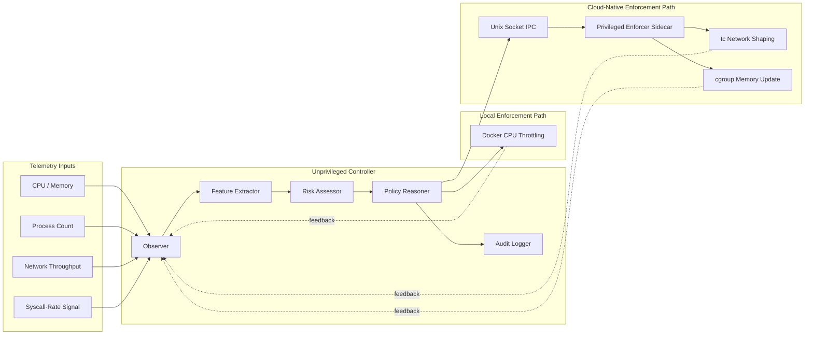

# Architecture Figure Spec

This file gives you a paper-ready architecture figure concept that matches the implemented repo better than the older draft.
It is designed for conversion into a clean vector figure in PowerPoint, draw.io, Figma, or LaTeX TikZ.

## Recommended figure title

Figure 1. RAASA architecture: adaptive containment loop with zero-trust privileged enforcement path.

## Figure intent

The figure should communicate two things at once:

1. the logical closed-loop controller,
2. the deployment-safe split between unprivileged reasoning and privileged enforcement in the Kubernetes path.

## Recommended layout

Use a two-layer horizontal layout.

Top band:

- Telemetry / observation inputs
- Feature extraction
- Risk scoring
- Policy reasoning
- Audit logging

Bottom band:

- Local Docker enforcement path
- Kubernetes privileged sidecar enforcement path

Add one feedback arrow from enforcement back to telemetry.

## Recommended node labels

### Logical control loop

- `Observer`
- `Feature Extractor`
- `Risk Assessor`
- `Policy Reasoner`
- `Audit Logger`

### Input details

- `CPU`
- `Memory`
- `Process Count`
- `Network Throughput`
- `Syscall-Rate Signal`

### Enforcement details

- `Docker CPU Throttling`
- `Unix Socket IPC`
- `Privileged Enforcer Sidecar`
- `tc Network Shaping`
- `cgroup Memory Update`

## Mermaid draft

## Caption draft

Figure 1. RAASA architecture. The controller continuously transforms runtime telemetry into normalized behavioral signals, computes a bounded risk score, and applies tiered containment decisions through either a local Docker path or a cloud-native privileged sidecar path. In the Kubernetes-oriented deployment, unprivileged reasoning is separated from privileged enforcement through Unix domain socket IPC, reducing the blast radius of autonomous decision logic.

## Visual guidance

- Use one color for the unprivileged reasoning path.
- Use a distinct warning color for privileged enforcement.
- Keep the Docker path visually simpler than the Kubernetes path.
- Avoid showing seccomp or CRIU in this figure, because that would reintroduce architecture/code mismatch.
- If space is tight, make Docker and Kubernetes enforcement small right-side branches from `Policy Reasoner`.

## Optional second figure

If the paper has space for two architecture-style figures:

- Figure 1: logical control loop
- Figure 2: zero-trust sidecar deployment on a Kubernetes node

That second figure can show:

- `raasa-agent` container running unprivileged,
- `raasa-enforcer` container running privileged,
- shared `/var/run/raasa/` socket / probe volume,
- pod-specific interface shaping on the host.
