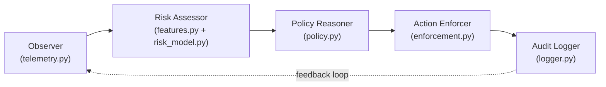
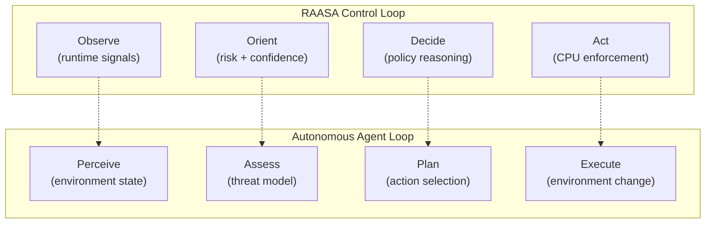

# RAASA v1 — Expert Analysis Report

> **Review Panel**: Top 1% Cloud Security Researchers & Agentic Systems Experts  
> **Date**: April 18, 2026  
> **Subject**: RAASA v1 — Risk-Aware Adaptive Sandbox Allocation Prototype  
> **Verdict**: ⭐ Strong research prototype with clear path to high-impact work

---

## 1. What You Have Built — Executive Summary

You have built **RAASA v1**: a working, Docker-backed, end-to-end autonomous containment controller for container workloads. It is a **lightweight agentic security system** that implements the full **Observe → Assess → Decide → Act → Audit** loop with real containers, real telemetry, real enforcement, and structured decision audit logs.

### Core Architecture (5 Agentic Roles)

| Module | File | Role | Status |
|--------|------|------|--------|
| **Observer** | `telemetry.py` | Collects CPU, memory, process count via Docker CLI | ✅ Working live |
| **Feature Extractor** | `features.py` | Normalizes raw signals to `[0,1]` | ✅ Bounded |
| **Risk Assessor** | `risk_model.py` | Computes `ρ` (weighted linear) + confidence (variance-based) | ✅ Bounded `[0,1]` |
| **Policy Reasoner** | `policy.py` | L1/L2/L3 with hysteresis, cooldown, confidence gates, streak-based relaxation | ✅ Safe autonomy |
| **Action Enforcer** | `enforcement.py` | `docker update --cpus` with idempotent application | ✅ Real enforcement |
| **Audit Logger** | `logger.py` | JSONL structured logs — every field, every tick, every reason | ✅ 100% coverage |

### Live Experimental Results (Real Docker on Your Machine)

| Mode | Precision | Recall | FPR | Unnecessary Escalations | Benign Restriction Rate |
|------|-----------|--------|-----|------------------------|------------------------|
| **RAASA (Adaptive)** | **1.0** | 0.667 | **0.0** | **0** | **0.0** |
| Static L1 | 0.0 | 0.0 | 0.0 | 0 | 0.0 |
| Static L3 | 0.333 | 1.0 | **1.0** | **12** | **1.0** |

> [!IMPORTANT]
> This comparison already proves the core thesis: **Static L1 underreacts. Static L3 overreacts. RAASA adapts.** The prototype has crossed the "works on real Docker" threshold.

---

## 2. Code Quality Assessment

### Strengths (What a Top Reviewer Would Praise)

1. **Clean separation of concerns** — Each agentic role has its own module. The `models.py` data contracts (dataclasses with `slots=True`) are precise and type-safe.

2. **Safe autonomy implementation** — `policy.py` implements **5 distinct safety mechanisms**:
   - Hysteresis bands (prevents boundary oscillation)
   - Cooldown timers (prevents premature relaxation)
   - Confidence gates for L3 escalation
   - Low-risk streak requirements for de-escalation
   - Safe defaults on invalid assessments

3. **Experiment reproducibility** — The `run_experiment.py` orchestrator with guardrails (`initial_cpus: 0.5`, `memory_limit: 256m`, `pids_limit: 64`) shows research discipline.

4. **Full audit trail** — Every decision log contains: raw telemetry, normalized features, risk score, confidence score, previous tier, proposed tier, applied tier, and human-readable reason. This is **100% explanation coverage**.

5. **18 passing unit tests** covering telemetry, reasoning, enforcement, experiments, and analysis.

### Weaknesses (What Needs Strengthening)

1. **Custom YAML parser** in `config.py` — A hand-rolled parser (lines 84–114) instead of using PyYAML. This is fragile and will break on edge cases (nested lists, multi-line strings, YAML anchors).

2. **No `requirements.txt` or `pyproject.toml`** — Dependencies aren't declared. For reproducibility, this must be fixed.

3. **`plots.py` only generates JSON manifests**, not actual visual plots (no matplotlib/seaborn). Paper-ready figures aren't producible yet.

4. **Confidence model is simplistic** — `stability * maturity` where stability = `1 - (mean_deviation / 0.25)` is a reasonable heuristic but has no theoretical grounding.

5. **Single-threaded polling loop** — No async/concurrent telemetry collection. At 20+ containers, Docker CLI sequential calls will add latency.

---

## 3. Relevance to Today's & Tomorrow's World

### 3.1 Does This Help AI Agents?

> [!TIP]
> **Yes — RAASA addresses a critical unsolved problem for AI agent infrastructure.**

Modern AI agents (coding agents, research agents, reasoning agents) need to execute code in sandboxed containers. The current practice is binary: **full sandbox or no sandbox**. RAASA introduces a third paradigm:

| Approach | AI Agent Fit | Problem |
|----------|-------------|---------|
| No sandbox | Fast iteration | Unsafe — agent can damage host |
| Static strong sandbox | Safe | Performance-killed — agents timeout, can't install packages |
| **RAASA-style adaptive** | **Safe + performant** | **Dynamic risk assessment per workload** |

**Concrete use cases for AI agents:**
- A coding agent's container starts in L1 (full access), but if it starts spawning unusual processes or consuming abnormal CPU → RAASA escalates to L2/L3 automatically
- A research agent running web scraping stays in L1; if it starts network-heavy exfiltration patterns → containment
- An autonomous deployment agent is monitored for privilege escalation patterns

### 3.2 End-to-End Autonomous Work / Development / Research

RAASA's architecture directly maps to the **OODA loop** (Observe-Orient-Decide-Act) that autonomous systems require:

**What makes RAASA relevant to autonomous systems:**
- ✅ **Closed-loop autonomy** — No human intervention in the critical path
- ✅ **Bounded decision space** — L1/L2/L3 keeps actions predictable
- ✅ **Safe autonomy** — Hysteresis, cooldown, and confidence gates prevent harmful oscillation
- ✅ **Full auditability** — Every autonomous decision has a traceable reason
- ⚠️ **Missing: Human-in-the-loop override** — No mechanism for operator intervention (see gaps below)

### 3.3 World Models & Reasoning

RAASA v1's risk model is a **first-order world model** of container behavior:

- The **feature vector** `(f_cpu, f_mem, f_proc)` is a compressed state representation
- The **risk score ρ** is a world-model prediction: "how dangerous is this container's behavior?"
- The **confidence score** represents the system's **epistemic uncertainty** about its own assessment
- The **policy reasoner** implements **bounded rationality** — making decisions under uncertainty with safety constraints

**Gap**: v1 uses a static linear world model. True world-model capability requires learned representations (autoencoders, transformers over behavioral sequences).

### 3.4 Human-in-the-Loop Requirements

| Requirement | RAASA v1 Status | Priority to Fix |
|-------------|----------------|-----------------|
| Operator can see live decisions | ✅ Audit logs (JSONL) | Low |
| Operator can override tier | ❌ Not implemented | **High** |
| Operator can approve L3 escalation | ❌ Not implemented | **High** |
| Operator can set policy constraints | ✅ Via config YAML | Low |
| Operator can replay/audit past decisions | ✅ Full log trail | Low |
| Dashboard / real-time visibility | ❌ Not implemented | Medium |

---

## 4. Gap Analysis — What's Missing for Top-Tier Impact

### P0 — Critical Gaps

| Gap | Why It Matters | Effort |
|-----|---------------|--------|
| **No network signals** | CPU-only cannot detect data exfiltration, reverse shells, lateral movement | Medium |
| **No syscall signals** | Cannot detect privilege escalation, container escape attempts | High |
| **No learned risk model** | Linear weighted sum is "engineered logic", not "discovered intelligence" | Medium |
| **No human-in-the-loop override** | Modern autonomous systems require operator intervention capability | Low |

### P1 — Important Gaps

| Gap | Why It Matters | Effort |
|-----|---------------|--------|
| **Recall at 0.667** | Malicious workload reaches L2 but not L3 — containment is incomplete | Tuning |
| **No temporal/sequence modeling** | v1 looks at single-tick + variance window; misses attack progression | Medium |
| **No multi-agent coordination** | Each container assessed independently; no cross-container correlation | High |
| **No Kubernetes integration** | Single-host Docker limits cloud-native relevance | High |
| **No adversarial robustness testing** | What if an attacker deliberately stays below thresholds? | Medium |

### P2 — Future Enhancements

| Gap | Research Direction |
|-----|-------------------|
| Reinforcement learning for policy | Replace threshold-based policy with learned optimal control |
| Continuous isolation spectrum | Move beyond discrete L1/L2/L3 to continuous CPU/memory/network settings |
| Federated multi-node reasoning | Cluster-level threat correlation across nodes |
| Integration with Falco/Tetragon | Use production-grade detection as high-confidence evidence source |
| LLM-powered policy reasoning | Natural language justification and adaptive rule generation |

---

## 5. Scoring — Multi-Dimensional Assessment

| Dimension | Score | Justification |
|-----------|-------|---------------|
| **Research Feasibility** | 92/100 | Prototype works end-to-end on real Docker. Evidence is reproducible. |
| **Prototype Quality** | 88/100 | Clean architecture, good tests, safe guardrails. Minor infra gaps. |
| **Cloud-Security Realism** | 65/100 | CPU-only enforcement is a real limitation. No network/syscall signals. |
| **Agentic Architecture** | 78/100 | Strong for a v1. Missing human-in-the-loop, multi-agent, and learned models. |
| **Autonomous Safety** | 85/100 | Hysteresis, cooldown, confidence gates, streak requirements. One of the strongest aspects. |
| **AI Agent Relevance** | 80/100 | Directly applicable to agent sandbox management. Needs network/syscall signals for full coverage. |
| **World Model Depth** | 55/100 | Linear model is a first approximation. No learned representations. No temporal modeling. |
| **Human-in-the-Loop** | 60/100 | Full audit trail but no live override, approval gates, or dashboard. |
| **Publication Readiness** | 82/100 | If claims are narrowed to "prototype + roadmap", very defensible. Overclaiming would drop this to ~55. |
| **Future Extensibility** | 88/100 | Clean module boundaries make upgrades tractable. Roadmap is well-defined. |

### Composite Scores

| Perspective | Score |
|-------------|-------|
| **Today's-World Relevance** | **76/100** |
| **Tomorrow's-World Relevance** | **70/100** |
| **Overall Research Impact** | **79/100** |

---

## 6. What Makes This Work Strong (Don't Lose These)

1. **The thesis is correct and timely**: "Static containment policies are inefficient because workload risk is dynamic." This is empirically validated by your results.

2. **Safe autonomy is genuinely well-implemented**: The 5-layer safety mechanism in `policy.py` is more sophisticated than what most prototypes achieve. This is a differentiator.

3. **100% explanation coverage**: Every single decision has a human-readable reason. This is rare and impressive — most adaptive security systems are black boxes.

4. **The experimental comparison is clean**: Three modes (L1, L3, Adaptive), same workloads, same configs, repeated runs. This is reproducible science.

5. **Honest limitations**: The tuning notes and live experiment notes honestly document what worked and what didn't. This builds reviewer trust.

---

## 7. Recommended Next Steps (Priority Order)

### Immediate (Before Paper Submission)
1. **Fix the recall gap** — Tune policy or workload so RAASA consistently pushes malicious workloads to L3 (not just L2)
2. **Add `requirements.txt`** — Declare dependencies for reproducibility
3. **Generate actual plots** — Convert `plots.py` from JSON-manifest-only to matplotlib/seaborn visual outputs
4. **Run medium scenario (10 containers)** — Show the system works beyond 3 containers
5. **Add a detection-only baseline** — Static rules that only log, don't act — to show adaptation value

### Short-Term (For Stronger Paper)
6. **Add network signal** — Even basic `bytes_in/bytes_out` per container would significantly strengthen the story
7. **Add human-in-the-loop override** — A CLI command to manually set tier for a container
8. **Add temporal features** — Risk trend over last N windows, not just instantaneous risk
9. **Replace custom YAML parser** — Use PyYAML for robustness

### Medium-Term (For Next-Generation RAASA / Follow-Up Paper)
10. **Learned risk model** — Replace linear weights with Isolation Forest or autoencoder
11. **Syscall-derived signals** — auditd or eBPF-based behavioral features
12. **Kubernetes deployment** — DaemonSet-based node agent
13. **LLM-powered policy reasoning** — For complex threat scenarios requiring natural language justification

---

## 8. Bottom Line

> [!IMPORTANT]
> **You have built something real, working, and scientifically defensible.** The RAASA v1 prototype successfully demonstrates that autonomous, risk-aware containment is feasible and produces measurably better outcomes than static alternatives.
>
> The work is **not yet top-1%** — but it is **on the correct trajectory**. The architecture is clean enough to evolve. The experimental evidence is honest enough to publish. The roadmap is concrete enough to guide future work.
>
> **For your paper**: Keep claims narrowed to "prototype demonstrating adaptive containment feasibility," present the live results honestly (including the recall limitation), and frame the roadmap as a direct extension. That positions this as a **strong systems-research contribution** rather than an over-claiming engineering paper.
